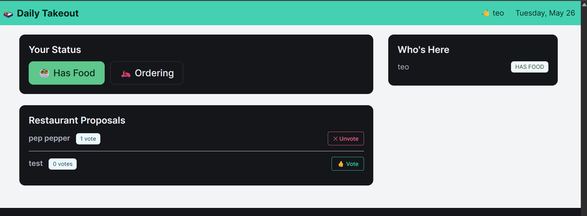

# Daily Takeout Coordinator



An internal tool for colleagues to coordinate daily lunch orders — no accounts, no setup, just open the app and go.

## How it works

### Joining

On your first visit you are redirected to `/join`, where you enter your name. The app stores it in a cookie (`takeout_user`) that lasts one year, so you only do this once per browser.

### Every day

Each calendar day gets its own fresh session. When you open `/today` you see who else is around and what is happening with lunch.

**Set your status** — pick one:
- **Has Food** — you brought something, you are not ordering
- **Ordering** — you want takeout today

### Proposing a restaurant

Anyone with status **Ordering** can suggest a restaurant. Type the name and submit; it appears as a proposal for the day. The same restaurant can only be proposed once per day.

### Voting

Once proposals are up, anyone can vote for the restaurant they want. Rules:
- You get one vote at a time
- Switching your vote automatically removes your previous one
- You can retract your vote entirely
- Votes are tallied live — no page reloads needed

### Seeing the result

The page shows all participants and their statuses, all proposals with their current vote counts, and highlights which proposal is leading. Everything updates in place via the API without a full page reload.

## Identity model

There is no login or password. Your identity is your chosen name stored in the browser cookie. If you clear cookies or switch browsers you will be asked to enter your name again.


---

## Commands

### Local run (from terminal, although VSCode Spring plugin is recommended)

```
./gradlew bootRun
```

As this is a spring boot app with a Tomcat server, local run is available at `localhost:8080`

---

## Deploying to Koyeb (free)

Koyeb offers a free always-on tier with no credit card required. The repo is already configured for it — a `Dockerfile` at the root handles the build and `application-prod.properties` sets the production config.

1. Push the repo to GitHub
2. Sign up at [koyeb.com](https://www.koyeb.com)
3. Create a new **Service** → **GitHub** → select your repo
4. Koyeb auto-detects the `Dockerfile` — no extra build config needed
5. Add a **Persistent Volume** mounted at `/data` (this is where the H2 database file lives)
6. Add the environment variable: `SPRING_PROFILES_ACTIVE=prod`
7. Deploy — you get a free `*.koyeb.app` HTTPS URL